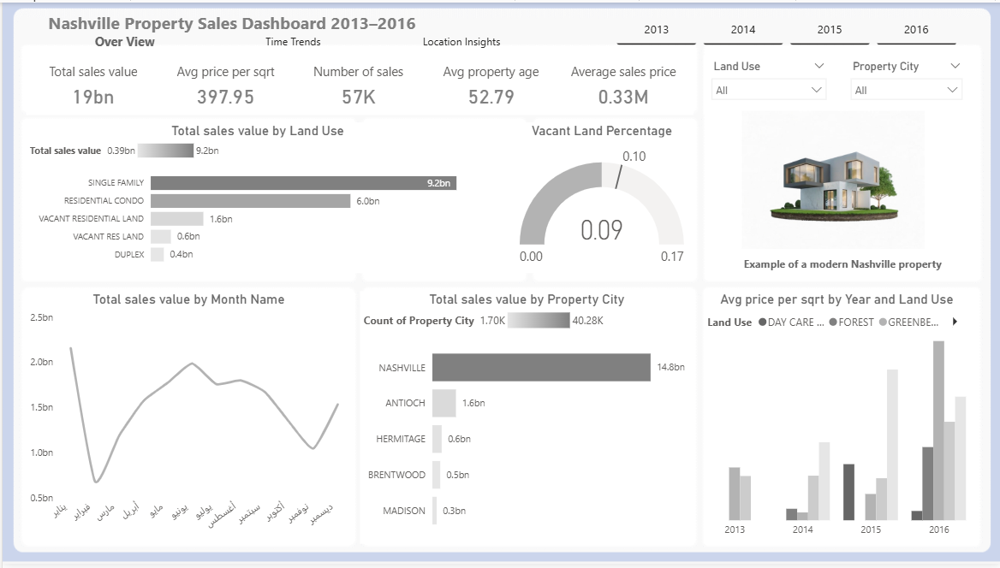

# Nashville-housing-data-analysis-2013-2016
A complete Power BI project analyzing Nashville housing sales between 2013–2016 (~57K transactions). 

##  Overview
A complete Power BI project analyzing Nashville housing sales between 2013–2016 (~57K transactions).  
Starting from raw, messy data, I applied **Power Query cleaning**, built a **Star Schema data model**, and designed an interactive dashboard to uncover real estate trends.

##  Data Preparation
- Removed duplicates (~5%).  
- Fixed missing values and inconsistent formatting.  
- Converted column types (price, date).  
- Filled blanks: `Sold_As_Vacant → No`, `Area → 0 or average`.  
- Added calculated fields: **Price per Sqft** and **Property Age**.

---

##  Data Modeling (Star Schema)
- **Fact_Sales**: core transactions (Sale_Price, Sale_Date, Parcel_ID).  
- **Dim_Time**: Year, Month_Name + Month_Number (for chronological sorting).  
- **Dim_Location**: Property_City, Neighborhood_Code.  
- **Dim_Parcel**: Parcel_ID, Address, Land_Use, Year_Built, Area, Acreage, Grade, Sold_As_Vacant.  
- **Relationships**: One-to-Many on Parcel_ID and Sale_Date.

---

##  Challenges
- Arabic month sorting (fixed with Month_Number).  
- Relationship errors due to duplicates.  
- Division by zero in Price per Sqft.  
- Performance optimization with 57K rows (early filtering).

---

##  Dashboard Pages
1. **Overview**  
   - Total sales ~19B  
   - Transactions ~57K  
   - Avg price ~330K  
   - Vacant land ~9%  
   - Sales by Land Use / City / Month  

2. **Time Trends**  
   - Peak monthly revenue (2014: ~1.31M, 2016: ~318K)  
   - Sales volatility (highest in 2014)  
   - YoY & MoM growth  

3. **Location Insights**  
   - Highest neighborhood avg price ~3.24M  
   - Lowest ~15K (vacant land)  
   - Avg acreage 0.52  
   - Top 10 most expensive properties (Residential Condo 9.5M–14M)  
   - Avg price/sqft by city (Mount Juliet ~3K, Brentwood 881)

---

##  Key Insights
- Market boomed in 2014–2015, slowed sharply in 2016.  
- Residential Condo dominated high-value sales.  
- Huge price range: 15K (vacant land) to 3.24M (neighborhood avg).  
- Nashville accounted for ~14.8B, followed by Antioch & Brentwood.

---

##  Recommendations
- **Investors**: Target Residential Condo in Nashville for high-value flips; vacant land for development (~15K entry).  
- **Developers**: Focus on high price/sqft areas (Brentwood, Mount Juliet) for luxury builds.  
- **Future Work**: Update with 2024–2025 data; monitor volatility >1M as sell signal.

---

##  Tools Used
- **Power Query** (data cleaning).  
- **Power BI** (dashboard design).  
- **Data Modeling** (Star Schema).
  
##  Project Structure
Nashville-Housing-Sales/
│
├── data/                # Raw & cleaned CSV/Excel
│   └── nashville_sales_data.xlsx
│
├── dashboard/           # Power BI file
│   └── nashville_sales_dashboard.pbix
│
├── images/              # Screenshots
│   ├── overview.png
│   ├── time_trends.png
│   └── location_insights.png
│
└── README.md            # Documentation
